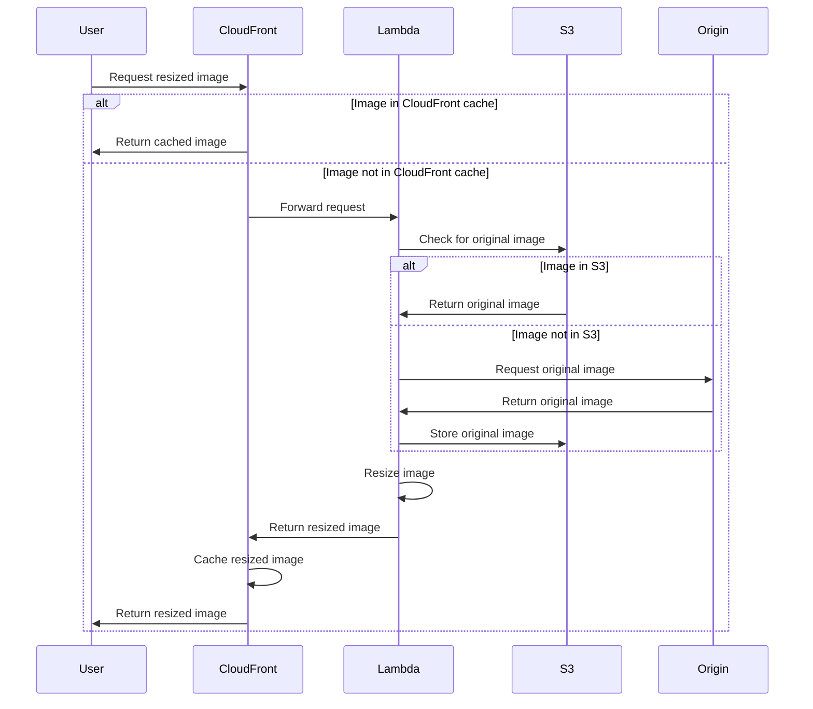

# Tachyon

Tachyon is a faster-than-light image resizing service that runs on AWS. Super simple to set up, highly available, and very performant.

## Setup

Tachyon comes in two parts: the server to serve images and the Jetpack plugin for manipulating images. To use Tachyon, you need to run at least one server, as well as configure the Jetpack plugin on all sites you want to use it.

### Plugin Configuration

```php
<?php
$cdn_image_domain_to_use        = 'https://{replace-me}.cloudfront.net';
$cdn_image_domain_to_use_parsed = wp_parse_url( $cdn_image_domain_to_use );

// Stop creating crops and just use the original image.
add_filter( 'jetpack_photon_noresize_mode', '__return_true' );

// Setup custom domain.
add_filter( 'jetpack_photon_domain', fn() => $cdn_image_domain_to_use );

// Trick Jetpack to use our domain. See https://github.com/Automattic/jetpack/blob/946220362c7db84cad03c7fae4c76c5930b46fd5/projects/packages/image-cdn/src/class-image-cdn-core.php#L163-L175
add_filter(
    'jetpack_photon_pre_image_url',
    function ( $image_url ) use ( $cdn_image_domain_to_use_parsed ) {
        // Replace host with CloudFront.
        $parse_url = wp_parse_url( $image_url );

        return str_replace( $parse_url['host'], $cdn_image_domain_to_use_parsed['host'], $image_url );
    },
    20
);
```

## Installation on AWS Lambda

We require using Tachyon on [AWS Lambda](https://aws.amazon.com/lambda/details/) to offload image processing tasks in a serverless configuration. This ensures you don't need lots of hardware to handle thousands of image resize requests and can scale essentially infinitely. One Tachyon stack is required per S3 bucket, so we recommend using a common region bucket for all sites, which then only requires a single Tachyon stack per region.


## Setup, install and deployment

Install Sam from here:
https://docs.aws.amazon.com/serverless-application-model/latest/developerguide/install-sam-cli.html

Run through the setup.

Then run the following commands:
```bash
git clone git@github.com:bauerxcelmedia/tachyon.git
cd tachyon
npm install
npm run build
npm run build-zip
```
This will give you the lambda.zip file that you can upload to your AWS Lambda function.

It is in the **am-digital-prod** account you can go to:
https://ap-southeast-2.console.aws.amazon.com/lambda/home?region=ap-southeast-2#/functions/photon-s3?tab=code
in order to upload the lambda.zip file.
### Lambda Function Spec

- **Runtime:** Node.js 18
- **Function URL:** Activated
- **Environment Variables:**
  - `S3_BUCKET=my-bucket`
  - `S3_REGION=my-bucket-region`
  - `DOMAIN=my-domain.com`

Take the `lambda.zip` from the latest release and upload it to your function.

### Lambda Function URL Configuration

For routing web traffic to the Lambda function, we recommend using [Lambda Function URLs](https://docs.aws.amazon.com/lambda/latest/dg/urls-configuration.html). These should be configured as:

- **Auth type:** None
- **Invoke mode:** `RESPONSE_STREAM`

We also recommend running an aggressive caching proxy/CDN in front of Tachyon, such as CloudFront. (An expiration time of 1 year is typical for a production configuration.)

### S3 Configuration with lamda

To allow the Lambda function to access your S3 bucket, you need to configure the following:

**IAM Role for Lambda:**
    - Create an IAM role with the following policy to allow access to the S3 bucket:


    {
        "Version": "2012-10-17",
        "Statement": [
            {
                "Effect": "Allow",
                "Action": [
                    "s3:GetObject",
                    "s3:PutObject"
                ],
                "Resource": "arn:aws:s3:::my-bucket/*"
            }
        ]
    }


Attach this IAM role to your Lambda function.

## Installation Guide for CloudFront

1. Create a new CloudFront distribution.
2. Set the origin to the Lambda Function URL.
3. Setup OAC (Origin Access Identity) to provide CloudFront access to the Lambda function.
    ```bash
    aws lambda add-permission \
    --statement-id "AllowCloudFrontServicePrincipal" \
    --action "lambda:InvokeFunctionUrl" \
    --principal "cloudfront.amazonaws.com" \
    --source-arn "arn:aws:cloudfront::************:distribution/***********" \
    --region "ap-southeast-2" \
    --function-name <YOUR_FUNCTION_NAME>
    ```
4. Setup behavior to forward all requests to the Lambda Function.
5. Setup cache control to cache the images for a long time (1 year is typical for a production configuration). Only forward the `Accept` header and use all query strings for the cache key.
6. Configure the origin request policy to forward all viewer headers except the `Host` header.

## Diagram



## Documentation

* [Using Tachyon](./docs/using.md)
* [Hints and Tips](./docs/tips.md)

## Credits

Original [Tachyon](https://github.com/humanmade/tachyon) service is created by Humanmade.

Tachyon is inspired by Photon by Automattic. As Tachyon is not an all-purpose image resizer, rather it uses a media library in Amazon S3, it has a different use case to [Photon](https://jetpack.com/support/photon/).

Tachyon uses the [Sharp](https://github.com/lovell/sharp) (used under the Apache License 2.0) Node.js library for the resizing operations, which in turn uses the great libvips library.

## Looking for a Different Tachyon?

Tachyon by Human Made provides image resizing services for the web and is specifically designed for WordPress. "Tachyon" is named after the [hypothetical faster-than-light particle](https://en.wikipedia.org/wiki/Tachyon).

Other software named Tachyon includes:

* [Tachyon by VYV](https://tachyon.video/) - Video playback and media server.
* [Tachyon by Cinnafilm](https://cinnafilm.com/product/tachyon/) - Video processing for the cinema industry.
* [TACHYONS](https://tachyons.io/) - CSS framework.