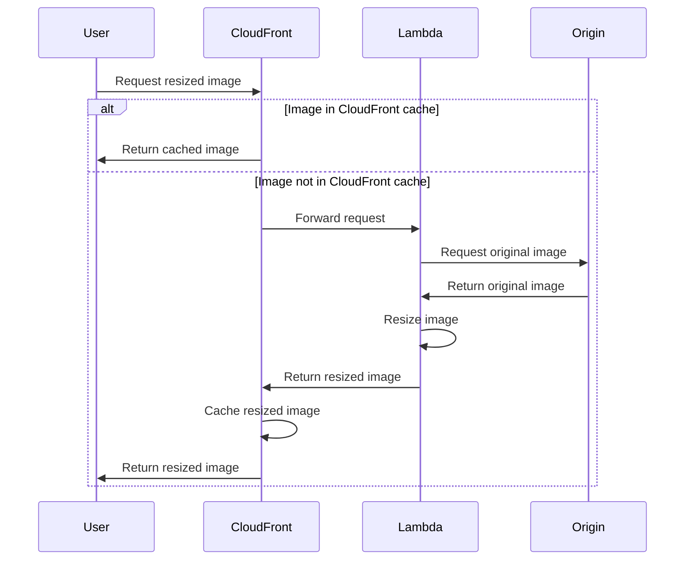

# Tachyon

Tachyon is a faster than light image resizing service that runs on AWS. Super simple to set up, highly available and very performant.

## Setup

Tachyon comes in two parts: the server to serve images and uses jetpack plugin for manipulating images. To use Tachyon, you need to run at least one server, as well as the jetpack plugin with additional plugin configuration on all sites you want to use it.

```php
<?php
$cdn_image_domain_to_use        = 'https://{replace-me}.cloudfront.net'
$cdn_image_domain_to_use_parsed = wp_parse_url( $cdn_image_domain_to_use );

// Stop creating crops and just use the original image.
add_filter( 'jetpack_photon_noresize_mode', '__return_true' );

// Setup custom domain.
add_filter( 'jetpack_photon_domain', fn() => $cdn_image_domain_to_use );

// Trick jetpack to use our domain. See https://github.com/Automattic/jetpack/blob/946220362c7db84cad03c7fae4c76c5930b46fd5/projects/packages/image-cdn/src/class-image-cdn-core.php#L163-L175
add_filter(
	'jetpack_photon_pre_image_url',
	function ( $image_url ) {
		// Replace host with cloudfront.
		$parse_url = wp_parse_url( $image_url );

		return str_replace( $parse_url['host'], $cdn_image_domain_to_use_parsed['host'], $image_url );
	},
	20
);
```

## Installation on AWS Lambda

We require using Tachyon on [AWS Lambda](https://aws.amazon.com/lambda/details/) to offload image processing task in a serverless configuration. This ensures you don't need lots of hardware to handle thousands of image resize requests, and can scale essentially infinitely. One Tachyon stack is required per S3 bucket, so we recommend using a common region bucket for all sites, which then only requires a single Tachyon stack per region.

Tachyon requires the following Lambda Function spec:

- Runtime: Node JS 18
- Function URL activated
- Env vars:
  - S3_BUCKET=my-bucket
  - S3_REGION=my-bucket-region
  - DOMAIN=my-domain.com

Take the `lambda.zip` from the latest release and upload it to your function.

For routing web traffic to the Lambda function, we recommend using [Lambda Function URLs](https://docs.aws.amazon.com/lambda/latest/dg/urls-configuration.html). These should be configured as:

- Auth type: None
- Invoke mode: `RESPONSE_STREAM`

We also recommend running an aggressive caching proxy/CDN in front of Tachyon, such as CloudFront. (An expiration time of 1 year is typical for a production configuration.)

## Diagram




## Documentation

* [Using Tachyon](./docs/using.md)
* [Hints and Tips](./docs/tips.md)

## Credits

Original [Tachyon](https://github.com/humanmade/tachyon) service is created by Humanmade.

Tachyon is inspired by Photon by Automattic. As Tachyon is not an all-purpose image resizer, rather it uses a media library in Amazon S3, it has a different use case to [Photon](https://jetpack.com/support/photon/).

Tachyon uses the [Sharp](https://github.com/lovell/sharp) (Used under the license Apache License 2.0) Node.js library for the resizing operations, which in turn uses the great libvips library.


## Looking for a different Tachyon?

Tachyon by Human Made provides image resizing services for the web, and is specifically designed for WordPress. "Tachyon" is named after the [hypothetical faster-than-light particle](https://en.wikipedia.org/wiki/Tachyon).

Other software named Tachyon include:

* [Tachyon by VYV](https://tachyon.video/) - Video playback and media server.
* [Tachyon by Cinnafilm](https://cinnafilm.com/product/tachyon/) - Video processing for the cinema industry.
* [TACHYONS](https://tachyons.io/) - CSS framework.
